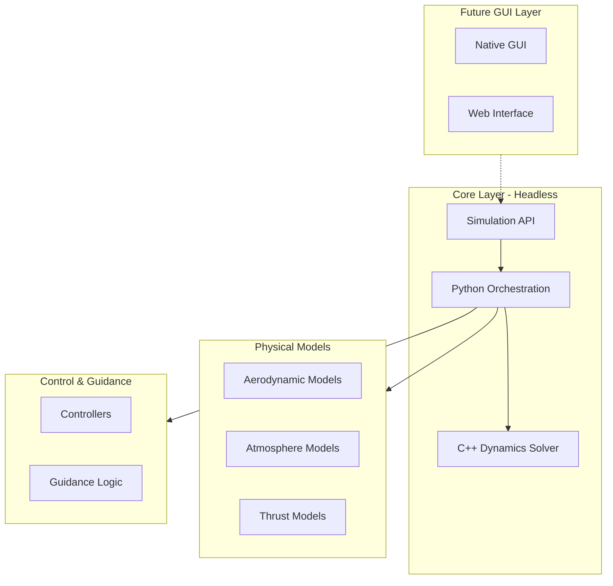

# 6-DOF Trajectory Simulator Implementation Plan

## Architecture Overview

The simulator follows a layered architecture with strict separation between:

- **Core Layer**: Headless computation (C++ dynamics solver + Python orchestration)
- **API Layer**: Clean interfaces for state management and simulation control
- **Future GUI Layer**: Native or web-based interfaces (out of scope for initial implementation)



## Project Structure

```
trajectory/
├── cpp/                          # C++ core library
│   ├── math/
│   │   ├── vector.hpp
│   │   └── quaternion.hpp
│   ├── frames/
│   │   └── transform.hpp
│   ├── dynamics/
│   │   └── rigid_body.cpp/hpp
│   ├── models/
│   │   ├── aero_model.hpp
│   │   ├── atmosphere.hpp
│   │   └── thrust.hpp
│   ├── integrators/
│   │   └── rk4.cpp/hpp
│   └── api/
│       └── simulator_api.cpp/hpp
├── src/                          # Python package (src-layout)
│   └── trajectory_sim/
│       ├── __init__.py
│       ├── core/                 # Core simulation engine
│       │   ├── __init__.py
│       │   ├── state.py          # State vector management
│       │   ├── simulator.py      # Main simulator class
│       │   └── api.py            # Public API interface
│       ├── config/
│       │   ├── __init__.py
│       │   ├── vehicle.py        # Vehicle properties
│       │   └── mission.py        # Initial conditions
│       ├── models/
│       │   ├── __init__.py
│       │   ├── coefficient_models.py
│       │   ├── atmosphere.py
│       │   └── thrust.py
│       ├── control/
│       │   ├── __init__.py
│       │   └── controller.py
│       ├── guidance/
│       │   ├── __init__.py
│       │   └── guidance.py
│       ├── monte_carlo/
│       │   ├── __init__.py
│       │   └── run.py
│       ├── visualization/
│       │   ├── __init__.py
│       │   ├── plots_2d.py
│       │   └── trajectory_3d.py
│       └── runner/
│           ├── __init__.py
│           └── single_run.py
├── tests/                        # Test suite
│   ├── test_cpp/
│   ├── test_python/
│   └── fixtures/
├── examples/                     # Example configurations
│   ├── free_fall/
│   ├── rocket/
│   └── aircraft/
├── CMakeLists.txt               # C++ build configuration
├── pyproject.toml               # Python package config (PEP 621)
├── README.md
└── .gitignore
```

## Implementation Details

### 1. C++ Core Library (`cpp/`)

**Math Utilities** (`math/`)

- `vector.hpp`: 3D vector operations (addition, subtraction, cross product, dot product, normalization)
- `quaternion.hpp`: Quaternion algebra (multiplication, normalization, rotation application)

**Frame Transformations** (`frames/`)

- `transform.hpp`: Coordinate frame transformations (I→B, B→A, quaternion rotation matrices)

**Dynamics** (`dynamics/`)

- `rigid_body.cpp/hpp`: 6-DOF equations of motion
  - Translational: `ṙ = v`, `v̇ = F/m`
  - Rotational: `q̇ = ½Ω(ω)q`, `Iω̇ + ω×Iω = M`

**Integrators** (`integrators/`)

- `rk4.cpp/hpp`: 4th-order Runge-Kutta integration method

**Models** (`models/`)

- `aero_model.hpp`: Abstract interface for aerodynamic coefficient evaluation
- `atmosphere.hpp`: Atmosphere density and wind models
- `thrust.hpp`: Thrust interpolation from CSV data

**API** (`api/`)

- `simulator_api.cpp/hpp`: C-style API for Python bindings
  - `State` struct (position, velocity, quaternion, angular velocity, mass)
  - `ControlInput` struct (p, q, r, i channels)
  - `step_simulation()` function

### 2. Python Package (`src/trajectory_sim/`)

**Core Module** (`core/`)

- `state.py`: State vector class with validation and conversion utilities
- `simulator.py`: Main `Simulator` class that orchestrates C++ solver
  - Manages state history
  - Coordinates models, control, and guidance
  - Provides headless execution interface
- `api.py`: Public API interface for GUI consumption
  - `SimulationRunner`: High-level interface for running simulations
  - `SimulationState`: Immutable state snapshots
  - Event callbacks for progress reporting

**Configuration** (`config/`)

- `vehicle.py`: Vehicle physical properties (mass, inertia tensor, reference areas)
- `mission.py`: Initial conditions (position, velocity, attitude, time settings)

**Models** (`models/`)

- `coefficient_models.py`: Python implementations of aerodynamic coefficient functions
- `atmosphere.py`: Atmosphere model wrappers (built-in or CSV-based)
- `thrust.py`: Thrust model with CSV interpolation

**Control & Guidance** (`control/`, `guidance/`)

- `controller.py`: Control law implementations (PID, etc.)
- `guidance.py`: Reference trajectory generation

**Monte-Carlo** (`monte_carlo/`)

- `run.py`: Batch simulation manager with parameter randomization

**Visualization** (`visualization/`)

- `plots_2d.py`: Time-history plotting (matplotlib)
- `trajectory_3d.py`: 3D trajectory visualization (matplotlib or plotly)

**Runner** (`runner/`)

- `single_run.py`: Single simulation execution script

### 3. Build System

**CMakeLists.txt**

- Configure C++ compilation (C++17 standard)
- Build shared library for Python bindings
- Use pybind11 or ctypes for Python-C++ interface
- Cross-platform support (Windows, Linux, macOS)

**pyproject.toml** (PEP 621)

- Package metadata and dependencies
- Build system configuration
- Optional dependencies for visualization
- Development dependencies

### 4. API Design for GUI Layer

The core provides a clean, headless API that GUI layers can consume:

```python
# Example API usage (future GUI can use this)
from trajectory_sim.core.api import SimulationRunner, SimulationConfig

runner = SimulationRunner(config)
runner.run(callback=progress_callback)  # Headless execution
results = runner.get_results()  # Get state history
```

This design allows:

- Native GUI: Use same API, wrap in Qt/Tkinter/etc.
- Web GUI: Expose API via REST/WebSocket, or use same API in web framework

### 5. Example Configurations

Create example configurations for:

- Free-fall object (parachute)
- Rocket with thrust
- Simple aircraft

Each example includes:

- Vehicle configuration
- Mission parameters
- Control/guidance setup
- Visualization scripts

## Key Design Decisions

1. **Headless Core**: No GUI dependencies in core modules
2. **Clean API**: `core/api.py` provides the interface for future GUI layers
3. **Separation of Concerns**: Models, control, and visualization are separate modules
4. **Extensibility**: Abstract interfaces allow easy addition of new models
5. **Performance**: C++ for numerical computation, Python for orchestration
6. **Cross-Platform**: CMake and standard Python packaging ensure portability

## Testing Strategy

- Unit tests for C++ components (Google Test or Catch2)
- Unit tests for Python modules (pytest)
- Integration tests for full simulation runs
- Example configurations serve as functional tests